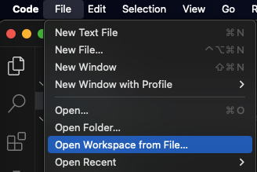
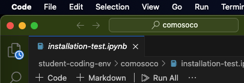
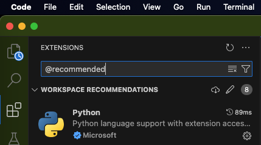
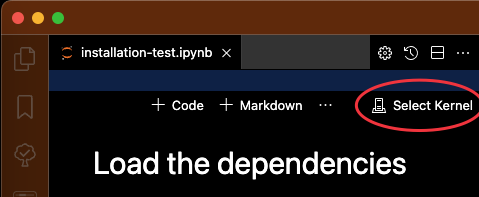
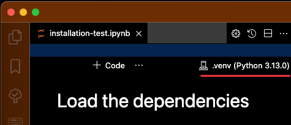

# Computational Models of Social Cognition (CoMoSoCo) - Python Environment

This repository contains a starter Python environment for running Jupyter notebooks used in the Computational Models of Social Cognition course. 

## Environment Setup

For this course, you need a Python environment that lets you run Jupyter Notebooks with `memo` models. While this guide suggests creating an environment that matches the one I'll be using for the tutorials, you can also use a more minimal setup. As long as you can successfully run notebooks like [`comosoco/installation-test.ipynb`](./comosoco/installation-test.ipynb), your setup should be sufficient.

### Install `Homebrew` (MacOS only)

> [Homebrew](https://brew.sh/) is a package manager for MacOS that simplifies software installation and management.

Follow the installation instructions on [https://brew.sh](https://brew.sh)

**Verify the installation:**

```bash
brew --version
```

<details>
  <summary>I can't or don't want to use homebrew!</summary>
  No problem, it just makes it easier to install and remove things on MacOS.
</details>

### Install `git`

> [git](https://git-scm.com/) is a version control system that helps manage code. Here's how to install it:

**With Homebrew:**

```bash
brew install git
```

**Without Homebrew:**

Follow the installation instructions on [https://git-scm.com/download/win](https://git-scm.com/download/win)

**Verify the installation:**

```bash
git --version
```

<details>
  <summary>I can't or don't want to use git!</summary>
  But git is great! Ok, though, you can skip it for now and download the repository directly as a ZIP file (see "Getting the Repository" section below).
</details>


### Install `uv`

> [Astral uv](https://docs.astral.sh/uv/) is a fast Python package installer that we'll use to set up the environment.

**With Homebrew:**

```bash
brew install uv
```

**Without Homebrew:**

Follow the install instructions on <https://docs.astral.sh/uv/getting-started/installation/>

**Verify the installation:**

```bash
uv --version
```

<details>
  <summary>I can't or don't want to use uv!</summary>
  Ok, we can work around that.
</details>

### Install `Task` (MacOS only)

> [Task](https://taskfile.dev/) is a task runner that simplifies common commands. While Task is not specific to MacOS, at the moment this repository only supports Task on MacOS.

**With Homebrew:**
```bash
brew install go-task
```

**Without Homebrew:**

Follow the installation instructions on <https://taskfile.dev/installation/>

**Verify the installation:**

```bash
task --version
```
<details>
  <summary>I can't or don't want to use Task!</summary>
  No problem, it's just for convenience.
</details>


### Install Visual Studio Code

VS Code is the recommended editor for this course:

1. Download VS Code from [https://code.visualstudio.com](https://code.visualstudio.com)
2. Install the downloaded file

<details>
  <summary>I can't or don't want to use VS Code!</summary>
  You can use any editor that supports Jupyter notebooks, but this README only gives instructions for VS Code.
</details>

### Clone this repository

Choose one of these methods:

**Option 1: Fork and Clone (Recommended)**
1. Create a GitHub account if you don't have one
2. Go to this repository [https://github.com/daeh/comosoco-env](https://github.com/daeh/comosoco-env)
3. Click the "Fork" button in the top-right corner
4. Clone your fork:
   ```bash
   git clone https://github.com/YOUR-USERNAME/comosoco-env.git
   cd comosoco-env
   ```

**Option 2: Direct Clone**
```bash
git clone https://github.com/daeh/comosoco-env.git
cd comosoco-env
```

**Option 3: Direct Download**

1. Visit [https://github.com/daeh/comosoco-env](https://github.com/daeh/comosoco-env)
2. Click the green "Code" button
3. Select "Download ZIP"
4. Extract the ZIP file
5. Navigate to the `comosoco-env` folder in your terminal

### Installing the Environment

Make sure you're in the `comosoco-env` directory, then choose one method:

**Option 1: Using `Task` (Easiest, MacOS)**

```bash
task install
```

**Option 2: Using `uv`**

```bash
uv sync
```

<details>
  <summary><strong>Option 3: Using <code>pip</code></strong></summary>

1, Make a virtual environment:

```bash
python -m venv .venv
```

2. Activate the environment:

MacOS/Linux:

```bash
source .venv/bin/activate
```

Windows (Command Prompt):

```cmd
.venv\Scripts\activate.bat
```

Windows (PowerShell):

```powershell
.venv\Scripts\Activate.ps1
```

3. Install packages:

```bash
pip install -r requirements-standard.txt
```

If you encounter issues, try using `requirements-minimal.txt` instead:

```bash
pip install -r requirements-minimal.txt
```

</details>


### Setting up `VS Code`

1. Open the VS Code application
2. Open `VSCProject.code-workspace`
    
   - You should see that the window name is "comosoco"
     

3. When prompted, **install recommended extensions**
   - If you don't see a prompt to install the recommended extensions, make sure you've correctly open the `VSCProject.code-workspace` file. You should see "comosoco" as the window name.
   - If you're sure you have the workspace open, you can manually install the extensions by searching for `@recommended` in the Extension Pane
     
   
4. Open `comosoco/installation-test.ipynb`
5. Set the Jupyter notebook to use the `.venv` python in `comosoco-env`
   - See below for screen shots.

6. Run all cells in the notebook - if they complete without error, your setup is working!






